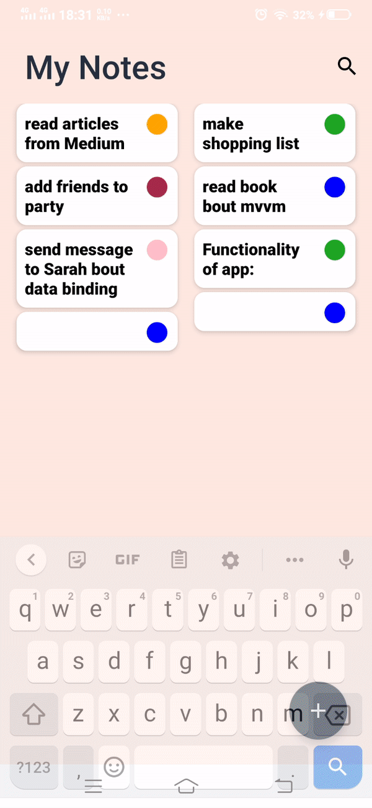

# MyNotes 

Notes is the best place to jot down quick thoughts or to save longer notes

## Demo

### Screenshots
    
    
   

#### Features
* Coroutines
* ViewModel
* Livedata
* DataBinding
* Room
* CardView
* RecyclerView with MultiSelection
* MVVM
* Shared elements transition
* Localization
