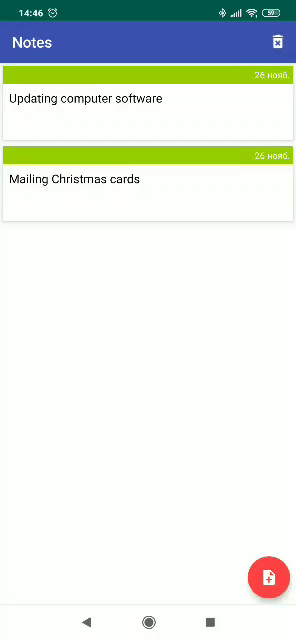

# Notes App 



## Screenshots

    

## Dependencies
```gradle
dependencies {
 - version_core = "1.1.0"
 - version_coroutine = "1.0.0"
 - version_navigation = "2.1.0"
 - version_constraint_layout = "1.1.3"
 - version_gradle = '3.5.2'
 - version_kotlin = "1.3.21"
 - version_lifecycle_extensions = "2.1.0"
 - version_room = "2.2.2"
 - version_appcompat = "1.1.0"
 - version_fragment = "1.1.0"      
}
```
